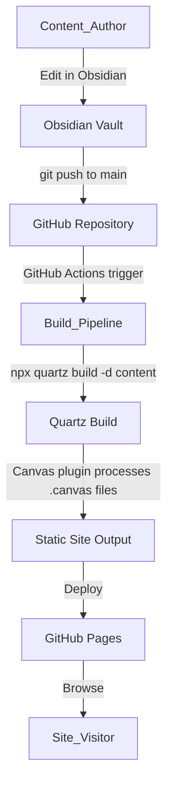

# Design Document: D&D Obsidian Wiki

## Overview

This design describes a static wiki for a Dungeons & Dragons group, built with Quartz v4 on top of an existing Obsidian vault. The vault is the single source of truth — Content_Authors edit markdown and canvas files in Obsidian, push to GitHub, and a GitHub Actions pipeline builds and deploys the site to GitHub Pages automatically.

The key technical challenge is canvas rendering: Quartz does not natively support `.canvas` files, so a custom Quartz plugin will parse the Obsidian Canvas JSON format and render interactive graphs using a client-side library.

### Content Organization

All publishable wiki content lives under a `content/` directory at the vault root. This follows Quartz's default content directory convention and cleanly separates wiki content from build tooling, templates, and configuration files.

```
content/
  index.md                          # Landing page (dynamically lists campaigns)
  campaigns/
    Saturday-Sorcerers/
      index.md                      # Campaign overview page
      characters/
        Steve.md
        Gandalf.md
      locations/
        Neverwinter.md
      sessions/
        Session-001.md
    Another-Campaign/
      index.md
      characters/
      locations/
      sessions/
```

Key structural decisions:
- **`content/` as Quartz content root**: The build uses `-d content` instead of `-d .`, so only files under `content/` are processed. This eliminates the need for extensive `ignorePatterns` in `quartz.config.ts`.
- **Campaign-centric hierarchy**: Each campaign is a self-contained folder under `content/campaigns/` with subfolders for characters, locations, and sessions.
- **Dynamic landing page**: `content/index.md` serves as the site home page and dynamically lists available campaigns. Quartz's FolderPage emitter or a manually maintained list of wikilinks can power this.
- **Templates stay outside content**: `_templates/` remains at the vault root (outside `content/`) so templates are accessible in Obsidian but excluded from the published site.
- **Example path**: A character named Steve from the Saturday Sorcerers campaign lives at `content/campaigns/Saturday-Sorcerers/characters/Steve.md`.

## Architecture



### Technology Choices

- **Static Site Generator**: Quartz v4 — native Obsidian compatibility (wikilinks, callouts, backlinks, graph view, tags, file explorer, search)
- **Canvas Rendering**: Custom Quartz transformer plugin + D3.js for client-side graph visualization
- **CI/CD**: GitHub Actions workflow
- **Hosting**: GitHub Pages

### Quartz v4 Plugin Architecture

Quartz v4 uses a plugin pipeline with three plugin types:

1. **Transformers**: Process content files (markdown → HTML). They can modify the AST, add metadata, and inject scripts/styles. This is where the canvas plugin lives.
2. **Filters**: Decide which files to include/exclude from the build.
3. **Emitters**: Generate output files (HTML pages, RSS, sitemaps, etc.).

A custom transformer plugin will intercept `.canvas` files, parse their JSON, and emit HTML + JavaScript that renders the graph client-side using D3.js.

## Components and Interfaces

### Component 1: Quartz Configuration (`quartz.config.ts`)

Quartz's central configuration file. Defines site metadata, theme, and plugin pipeline.

**Responsibilities**:
- Set site title, description, base URL for GitHub Pages
- Configure dark-mode D&D theme (colors, fonts)
- Register the custom Canvas transformer plugin in the plugin pipeline
- Configure built-in plugins: wikilinks, backlinks, graph view, explorer, search, tags
- Configure `ignorePatterns` relative to the `content/` directory (minimal patterns needed since non-content files are outside the content root)

**Content Directory Convention**:
- The Quartz build command uses `-d content` to set the content root
- `ignorePatterns` in `quartz.config.ts` are relative to the content directory (`content/`)
- Since `_templates/`, `node_modules/`, `.obsidian/`, etc. are outside `content/`, they are automatically excluded
- Only patterns for files within `content/` that should be excluded (e.g., `private`) need to be listed

**Interface**:
```typescript
// quartz.config.ts
const config: QuartzConfig = {
  configuration: {
    pageTitle: "Campaign Wiki",
    enableSPA: true,
    enablePopovers: true,
    baseUrl: "<username>.github.io/<repo>",
    locale: "en-US",
    ignorePatterns: ["private"],  // minimal — most non-content is outside content/
    theme: {
      typography: { header: "Cinzel", body: "Source Sans Pro", code: "Fira Code" },
      colors: {
        lightMode: { /* light palette */ },
        darkMode: {
          light: "#1a1a2e",      // page background
          lightgray: "#2a2a3e",  // borders
          gray: "#8888aa",       // graph links, heavier borders
          darkgray: "#ccccdd",   // body text
          dark: "#e8d5b7",       // headings, icons (parchment gold)
          secondary: "#7b4bcf",  // link color (purple accent)
          tertiary: "#9d6bff",   // hover states
          highlight: "#2a2a4e",  // internal link background
          textHighlight: "#7b4bcf33", // search match
        },
      },
    },
  },
  plugins: {
    transformers: [
      // ... built-in transformers
      Plugin.CanvasTransformer(), // custom canvas plugin
    ],
    filters: [Plugin.RemoveDrafts()],
    emitters: [
      // ... built-in emitters
    ],
  },
}
```

### Component 2: Canvas Transformer Plugin

A custom Quartz transformer plugin that processes `.canvas` files into renderable HTML pages.

**Responsibilities**:
- Detect `.canvas` files during the build
- Parse the Obsidian Canvas JSON format
- Generate an HTML page with embedded graph data and a D3.js visualization script
- Resolve wikilink references in canvas nodes to site URLs

**Obsidian Canvas JSON Format**:
```typescript
interface CanvasFile {
  nodes: CanvasNode[];
  edges: CanvasEdge[];
}

interface CanvasNode {
  id: string;
  type: "text" | "file" | "link" | "group";
  x: number;
  y: number;
  width: number;
  height: number;
  text?: string;       // for type "text"
  file?: string;       // for type "file" — vault-relative path
  url?: string;        // for type "link"
  label?: string;      // for type "group"
  color?: string;
}

interface CanvasEdge {
  id: string;
  fromNode: string;
  toNode: string;
  fromSide?: "top" | "right" | "bottom" | "left";
  toSide?: "top" | "right" | "bottom" | "left";
  label?: string;
  color?: string;
}
```

**Plugin Interface**:
```typescript
// quartz/plugins/transformers/canvas.ts
import { QuartzTransformerPlugin } from "../types"

export const CanvasTransformer: QuartzTransformerPlugin = () => ({
  name: "CanvasTransformer",
  textTransform(ctx, src) {
    // If file ends in .canvas, parse JSON and return HTML + D3 script
    // Otherwise, pass through unchanged
  },
  markdownPlugins() { return [] },
  htmlPlugins() { return [] },
  externalResources() {
    return { js: [{ src: "https://d3js.org/d3.v7.min.js", loadTime: "afterDOMReady" }] }
  },
})
```

**Rendering Logic**:
1. Parse the `.canvas` JSON
2. Validate structure — if malformed, emit an error message HTML block
3. Map nodes to SVG elements positioned by their `x`, `y`, `width`, `height`
4. Map edges to SVG lines/paths connecting node pairs
5. For `file` type nodes, resolve the vault path to a site URL and wrap in an `<a>` tag
6. For `group` type nodes, render a background rectangle encompassing child nodes
7. For `text` type nodes, render markdown content inside the node
8. Embed the graph data as a JSON blob in a `<script>` tag and use D3.js to render interactively

### Component 3: D3.js Canvas Visualization (Client-Side)

**Responsibilities**:
- Read embedded canvas JSON data from the page
- Render an interactive SVG graph with pan and zoom
- Style nodes by type (text, file, link, group)
- Draw edges with optional labels
- Make file-reference nodes clickable (navigate to linked page)

**Interface**:
```typescript
// quartz/static/scripts/canvas-graph.inline.ts
interface CanvasGraphOptions {
  containerId: string;
  canvasData: CanvasFile;
  baseUrl: string;
}

function renderCanvasGraph(options: CanvasGraphOptions): void
```

### Component 4: GitHub Actions Build Pipeline

**Responsibilities**:
- Trigger on push to `main` branch
- Check out the repository
- Install Node.js and dependencies
- Run `npx quartz build -d content`
- Deploy the `public/` output directory to GitHub Pages

**Interface** (`.github/workflows/deploy.yml`):
```yaml
name: Deploy Quartz to GitHub Pages
on:
  push:
    branches: [main]
  workflow_dispatch:

permissions:
  contents: read
  pages: write
  id-token: write

concurrency:
  group: "pages"
  cancel-in-progress: false

jobs:
  build-and-deploy:
    runs-on: ubuntu-latest
    environment:
      name: github-pages
      url: ${{ steps.deployment.outputs.page_url }}
    steps:
      - uses: actions/checkout@v4
      - uses: actions/setup-node@v4
        with:
          node-version: 20
      - run: npm ci
      - run: npx quartz build -d content
      - uses: actions/upload-pages-artifact@v3
        with:
          path: public
      - id: deployment
        uses: actions/deploy-pages@v4
```

### Component 5: Content Templates

Starter markdown templates that demonstrate common D&D wiki page structures. Templates live at the vault root in `_templates/` (outside `content/`) so they are accessible in Obsidian but excluded from the published site.

**Templates**:
- `_templates/Campaign.md` — campaign overview with frontmatter (campaign name, DM, setting, status, tags). Sections for world overview, major factions, active quests, and wikilink lists for linked locations, PCs, NPCs, and session notes. This template is intended to be copied to `content/campaigns/<Campaign-Name>/index.md`.
- `_templates/Character.md` — character sheet with frontmatter (name, race, class, level, player, type: PC|NPC, campaign, tags). Sections for backstory, appearance, abilities, relationships (wikilinks to other characters), and associated locations. Intended destination: `content/campaigns/<Campaign-Name>/characters/<Character-Name>.md`.
- `_templates/Location.md` — location page with frontmatter (name, type, region, campaign, tags). Sections for description, notable NPCs (wikilinks), connected locations, and history. Intended destination: `content/campaigns/<Campaign-Name>/locations/<Location-Name>.md`.
- `_templates/Session Notes.md` — session log with frontmatter (session number, date, campaign, players present, tags). Sections for recap, key events, NPCs encountered (wikilinks), loot/rewards, and next session hooks. Intended destination: `content/campaigns/<Campaign-Name>/sessions/Session-NNN.md`.

Templates use Obsidian frontmatter and wikilinks to demonstrate the content model. Each template includes a comment at the top indicating where to copy it within the `content/campaigns/` hierarchy.

### Component 6: Landing Page and README

- `content/index.md` — the wiki home page. Dynamically lists available campaigns by linking to each campaign's `index.md` under `content/campaigns/`. Uses wikilinks to campaign overview pages (e.g., `[[campaigns/Saturday-Sorcerers/index|Saturday Sorcerers]]`). Includes quick-start instructions and links to the contributor guide.
- `README.md` — contributor guide with setup instructions (clone, open in Obsidian, edit, commit, push). Updated to explain the `content/` folder structure and the campaign-centric organization. Instructs Content_Authors to create new campaigns by creating a folder under `content/campaigns/` with the standard subfolder structure (characters, locations, sessions) and an `index.md` overview page.

## Data Models

### Canvas File Data Model

The Obsidian Canvas format is a JSON file with two arrays:

```typescript
interface CanvasData {
  nodes: CanvasNode[];
  edges: CanvasEdge[];
}

interface CanvasNode {
  id: string;
  type: "text" | "file" | "link" | "group";
  x: number;
  y: number;
  width: number;
  height: number;
  text?: string;
  file?: string;
  url?: string;
  label?: string;
  color?: string;
}

interface CanvasEdge {
  id: string;
  fromNode: string;
  toNode: string;
  fromSide?: "top" | "right" | "bottom" | "left";
  toSide?: "top" | "right" | "bottom" | "left";
  label?: string;
  color?: string;
}
```

**Validation Rules**:
- `nodes` and `edges` arrays must exist (may be empty)
- Each node must have `id`, `type`, `x`, `y`, `width`, `height`
- Each edge must have `id`, `fromNode`, `toNode`
- `fromNode` and `toNode` must reference existing node IDs
- `type` must be one of the four allowed values

### Quartz Content Metadata

Quartz extracts frontmatter from markdown files:

```typescript
interface PageMetadata {
  title: string;
  tags?: string[];
  description?: string;
  draft?: boolean;
  date?: string;
}
```


## Correctness Properties

*A property is a characteristic or behavior that should hold true across all valid executions of a system — essentially, a formal statement about what the system should do. Properties serve as the bridge between human-readable specifications and machine-verifiable correctness guarantees.*

The custom Canvas_Renderer is the primary component with testable logic. Quartz's built-in features (wikilinks, callouts, backlinks, search, explorer, tags) are tested by the Quartz project itself and are configured rather than implemented. The properties below focus on the canvas parsing and rendering pipeline, which is the custom code in this project.

### Property 1: Canvas parse round-trip

*For any* valid CanvasData object, serializing it to JSON and then parsing it back should produce an equivalent CanvasData object (same nodes and edges with identical properties).

**Validates: Requirements 3.1**

### Property 2: Canvas node rendering completeness

*For any* valid CanvasData object, the rendered HTML output should contain exactly one element for each node in the input, where:
- Text nodes contain their text content
- File nodes contain a link to the resolved page URL
- Group nodes are rendered as container elements with their label
- Link nodes contain their URL

**Validates: Requirements 3.2, 3.4, 3.5, 3.6**

### Property 3: Canvas edge rendering completeness

*For any* valid CanvasData object, the rendered HTML output should contain exactly one connection element for each edge in the input, connecting the correct source and target nodes.

**Validates: Requirements 3.3**

### Property 4: Canvas malformed JSON produces error message

*For any* string that is not valid JSON or does not conform to the CanvasData schema, the Canvas_Renderer should produce an HTML output containing an error message and should not throw an exception.

**Validates: Requirements 3.7**

### Property 5: Canvas node ID uniqueness preservation

*For any* valid CanvasData object, the rendered output should preserve the one-to-one mapping between input node IDs and rendered node elements — no duplicates, no missing nodes.

**Validates: Requirements 3.2**

### Property 6: Canvas edge reference integrity

*For any* valid CanvasData object, every edge's `fromNode` and `toNode` references should correspond to rendered node elements in the output.

**Validates: Requirements 3.3**

## Error Handling

### Canvas File Errors

| Error Condition | Handling Strategy |
|---|---|
| Malformed JSON in `.canvas` file | Display a styled error message on the page: "This canvas file could not be rendered. The file may contain invalid JSON." Log the parse error to build console. |
| Missing required fields in canvas node | Skip the malformed node, render remaining nodes, display a warning banner noting skipped nodes. |
| Edge references non-existent node ID | Skip the orphaned edge, render remaining edges, log a warning to build console. |
| File-type node references non-existent vault file | Render the node without a link, display the file path as plain text with a "missing" indicator. |

### Build Pipeline Errors

| Error Condition | Handling Strategy |
|---|---|
| Quartz build fails | GitHub Actions job fails, status check shows failure. Error details visible in Actions log. |
| Node.js dependency installation fails | GitHub Actions job fails at `npm ci` step. |
| GitHub Pages deployment fails | GitHub Actions deployment step fails, status check shows failure. |

### Content Errors

| Error Condition | Handling Strategy |
|---|---|
| Markdown file with invalid frontmatter | Quartz uses defaults (filename as title, no tags). File is still rendered. |
| Broken wikilink (target page doesn't exist) | Quartz renders the link with a "does not exist" style (different color, no navigation). Built-in behavior. |
| Image reference to missing file | Broken image placeholder shown. Standard browser behavior. |

## Testing Strategy

### Testing Approach

This project uses a dual testing approach:

1. **Property-based tests**: Validate universal correctness properties of the Canvas_Renderer using generated inputs
2. **Unit tests**: Validate specific examples, edge cases, and configuration correctness

### Property-Based Testing

**Library**: [fast-check](https://github.com/dubzzz/fast-check) (TypeScript property-based testing library)

**Configuration**:
- Minimum 100 iterations per property test
- Custom arbitraries for generating valid CanvasData objects (random nodes, edges, types)

**Test Organization**:
- All property tests in `quartz/plugins/transformers/__tests__/canvas.property.test.ts`
- Each test tagged with design property reference

**Property Test Plan**:

| Property | Test Description | Tag |
|---|---|---|
| Property 1 | Generate random CanvasData, serialize to JSON, parse back, assert equivalence | Feature: dnd-obsidian-wiki, Property 1: Canvas parse round-trip |
| Property 2 | Generate random CanvasData, render to HTML, assert each node has a corresponding element with correct content by type | Feature: dnd-obsidian-wiki, Property 2: Canvas node rendering completeness |
| Property 3 | Generate random CanvasData with edges, render to HTML, assert each edge has a corresponding connection element | Feature: dnd-obsidian-wiki, Property 3: Canvas edge rendering completeness |
| Property 4 | Generate random non-JSON strings and invalid JSON objects, pass to renderer, assert error message HTML returned without exceptions | Feature: dnd-obsidian-wiki, Property 4: Canvas malformed JSON produces error message |
| Property 5 | Generate random CanvasData, render, assert bijection between input node IDs and rendered element IDs | Feature: dnd-obsidian-wiki, Property 5: Canvas node ID uniqueness preservation |
| Property 6 | Generate random CanvasData, render, assert every edge's fromNode/toNode has a corresponding rendered element | Feature: dnd-obsidian-wiki, Property 6: Canvas edge reference integrity |

### Unit Testing

**Library**: Vitest (ships with Quartz v4's Node.js toolchain)

**Test Organization**:
- Unit tests in `quartz/plugins/transformers/__tests__/canvas.unit.test.ts`

**Unit Test Plan**:

| Test | Description |
|---|---|
| Parse minimal canvas | Parse a canvas with one text node and no edges, verify structure |
| Parse empty canvas | Parse `{"nodes":[],"edges":[]}`, verify empty arrays |
| Render file node with valid path | Verify the rendered link points to the correct resolved URL |
| Render group node | Verify group renders as a container with label |
| Edge with label | Verify edge label appears in rendered output |
| Missing node reference in edge | Verify edge is skipped and warning is produced |
| Completely empty file | Verify error message is shown |
| Non-JSON content | Verify error message is shown |

### What Is NOT Tested

- Quartz built-in features (wikilinks, callouts, backlinks, search, explorer, tags) — these are tested by the Quartz project
- GitHub Actions pipeline execution — verified by running the workflow, not by unit tests
- Visual appearance / CSS styling — verified by manual inspection
- GitHub Pages deployment timing — infrastructure concern
