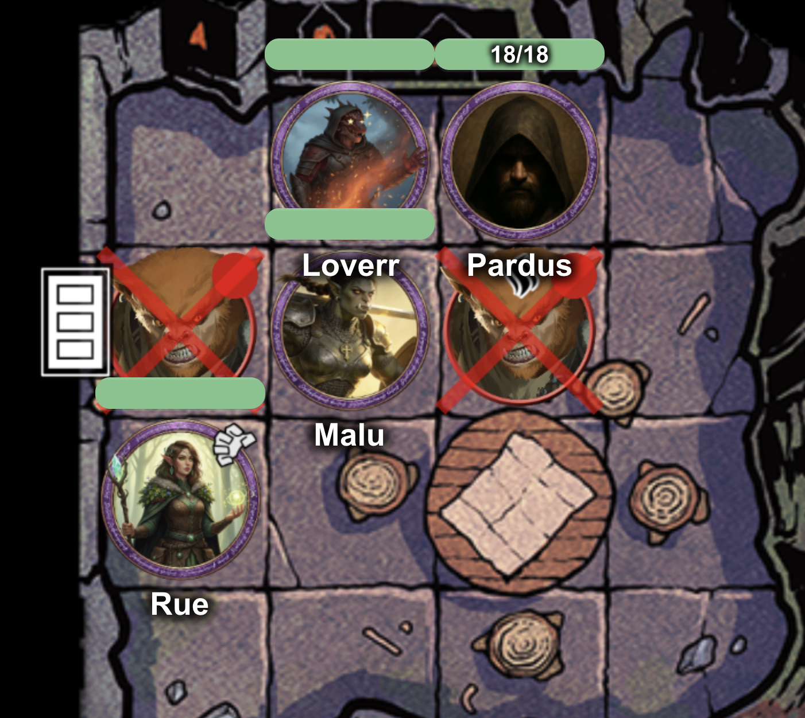

# Friday Knights

> [!info] Campaign Details
> **DM:** Dungeon Master Name  
> **Setting:** Setting / World Name  
> **Status:** Active

## World Overview

Describe the world, its history, and the current state of affairs. What makes this setting unique? What are the major themes of the campaign?

## Major Factions

- **Faction Name** — Brief description of the faction and their goals.
- **Faction Name** — Brief description of another faction.

## Active Quests

- [ ] **Quest Name** — Short summary. Given by [[characters/NPC Name]].
- [ ] **Quest Name** — Short summary. Location: [[locations/Location Name]].

## Locations

Key locations in the campaign world:

- [[The Keep On The Borderlands]] — Brief description
- [[locations/Location Name]] — Brief description
- [[locations/Location Name]] — Brief description

## Player Characters

- [[characters/Character Name]] — Race, Class (Player Name)
- [[characters/Character Name]] — Race, Class (Player Name)
- [[characters/Character Name]] — Race, Class (Player Name)

## NPCs

Notable non-player characters:

- [[characters/NPC Name]] — Role or title, relationship to the party
- [[characters/NPC Name]] — Role or title, relationship to the party
- [[characters/NPC Name]] — Role or title, relationship to the party

## Session Notes

- [[sessions/Session 001]]
- [[sessions/Session 002]]
- [[sessions/Session 003]]

## Notes of Pardus

- Loverr returns!
- We tangle with a Carrion Crawler and trade the remains to Nothic for a sweet Cape of Billowing. It's a good thing Loverr speaks Undercommon.
- Malu gets a new helmet after Loverr flexes her lock picking skillz. Seriously, how did E4 manage to stay alive without dragon backup?
- We explore a new section of The Caves of Chaos and end up slapping around a couple of Bugbears who were in the middle of making a terrible map. The group decides to continue our tradition of taking a nap in a room filled the bodies of our enemies.
- The E4 hoard is now up to 315 GP and a collection of dope artifacts.
